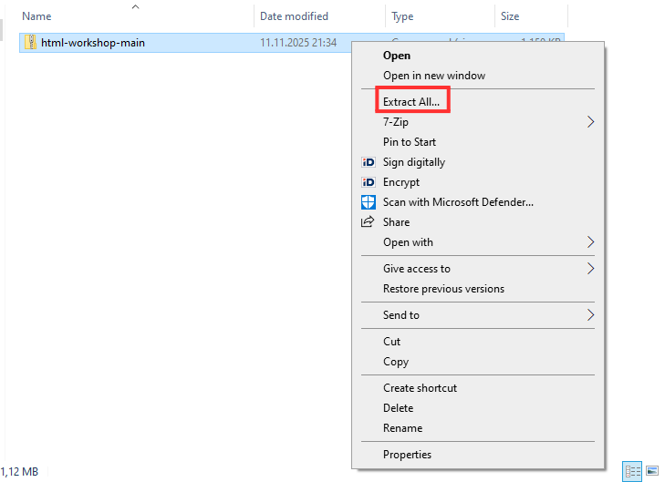

# Veebilehe töötuba

Kuidas mall välja näeb? [https://taltech-coding.github.io/html-workshop/](https://taltech-coding.github.io/html-workshop/)

Tegu on repoga, mida kasutatakse TalTechi veebilehe tegemise töötoas.

NB! Kuna selles keskkonnas ei saa projekti lisada pilte siis tutorialit soovitan vaadata githubist!

Samuti kuna me ei saa projekti pilte lisada siis tuleb pildid lisada linkidena. Selleks kasutame https://tinyurl.com, et piltide lingid ei oleks massiivsed.

Selles töötoas saad teha endale ilusa veebilehe! Kujundame CSS-i kasutades ühe stiilse HTML veebilehe.
Eelnev kogemus ei ole oluline.

## Tutorial

1. Lae alla repository.

2. Ava allalaetud ZIP-fail ning extracti ehk paki see lahti sobivasse asukohta oma arvutis.

3. Ava HCODX veebirakendus https://hcodx.com.
4. Sealt vali.

5. Vajuta "Select Folder" ja otsida üles asukoht kuhu töötoa fail sai salvestatud.

6. Nüüd on kõik failid õiges kohas! Joontega ümbritsetud kaks võimalust, kuidas oma veebilehte näha. Vasak nupp loob side-by-side vaate, kus veebileht iga muutusega uueneb. Parem nupp avab uue tab'i, kus on näha veebilehte, aga iga muudatuse korral tuleb veebileht uuesti samast nupust tööle panna.


## Repos on:
* index.html - veebilehe HTML mall
* style.css - veeblehe CSS-i mall
* images kaust, kus on pildid, mida index.html-is kasutatakse
* README.md koos seal kasutatavate piltidega (tutorial_img_1.png ja tutorial_img_2.png)
* given_template.jpg, kus on kirjas, mida on vaja teha.

## Materjalid ja lingid
- [veebileht](https://htmldoc.pages.taltech.ee/)
- [slaidid](https://docs.google.com/presentation/d/1IIEsvgF68YxoXBrTw4Q3hZHinvBzRxxvQ3_BGsVhlcY/edit?usp=sharing)

## Iseseisev lahendamine

- Töötoa eesmärgiks on koostada veebileht millegi/kellegi kohta.
- Veebileht peaks olema sarnane ette toodud veebilehega (given_template.jpg)
- Sinu ülesandeks on antud malli (index.html, style.css) vastavalt soovidele muuta

## Sisu lisamine (HTML)
#### Töötame failis `index.html`
### 1. Pealkirja muutmine veebilehe peal

Praegu on sinu üheks veebilehe pealkirjaks lihtsalt "Nimetus". Muuda kõik sellised pealkirjad sobivaks.

<details>
<summary>💡 Vihje</summary>

Otsi failist üles element `<h1>...</h1>` ning muuda nende vahel olevat teksti.
- `h1` tähistab kõige suuremat pealkirja
</details>

<details>
<summary>🛠️ Lahendus</summary>

```html
<div class="container" style="padding: 1em">
    <div id="textBox">
        <h1>MUUDA SEE ÄRA</h1>
        <p>Lorem ipsum dolor sit amet, consectetur adipiscing elit.Curabitur eget lectus mi. Donec lorem magna,
            elementum ac dui in, posuere pharetra odio. Lorem ipsum dolor sit amet, consectetur adipiscing elit.
            Curabitur eget lectus mi. Donec lorem magna, elementum ac dui in, posuere pharetra odio.</p>
    </div>
    
</div>
```

</details>

### 2. Teksti muutmine

Hetkel on meil seal palju ladinakeelset teksti, kuid soovime sinna midagi sisukamat - sinu veebilehele sobivamat.
Muuda tekst igal pool, kus malli järgi (`given_template.png`) on palutud.

<details>
<summary>💡 Vihje</summary>

Otsi failist üles element `<p>...</p>` ning muuda nende vahel olevat teksti.
- `p` tähistab veebilehel olevat kõige "tavalisemat" teksti.
</details>

<details>
<summary>🛠️ Lahendus</summary>

```html
<div class="container" style="padding: 1em">
    <div id="textBox">
        <h1>Nimetus</h1>
        <p>MUUDA SEE ÄRA</p>
    </div>
    
</div>
```
</details>


### 3. Pildi lisamine ja muutmine

Leia endale meelepärased pildid. Kui oled leidnud pildid siis kopeeri selle pildi link https://tinyurl.com ja kasuta sealt lühemat linki, sest muidu need võtavad pool meie projekti endale.

<details>
<summary>💡 Vihje 1</summary>

Pildi lisamine projekti käib järgnevalt:
- Otsi internetist mõni tore pilt.
- Kopeeri selle pildi link.
- Mine faili `index.html` ning asenda vana pilt uuega
</details>

<details>
<summary>💡 Vihje 2</summary>

Lisa väljas `img` asuvale `src` alale uue pildi asukoht.
- Kui tegid soovitatult siis peaks selle asukoht olema nt  `https://tinyurl.com/bdd5c7kk`
</details>

<details>
<summary>🛠️ Lahendus</summary>

```html
<div class="container" style="padding: 1em">
    <div id="textBox">
        <h1>Nimetus</h1>
        <p>Lorem ipsum dolor sit amet, consectetur adipiscing elit.Curabitur eget lectus mi. Donec lorem magna,
            elementum ac dui in, posuere pharetra odio. Lorem ipsum dolor sit amet, consectetur adipiscing elit.
            Curabitur eget lectus mi. Donec lorem magna, elementum ac dui in, posuere pharetra odio.</p>
    </div>
    
</div>
```
</details>

### 4. Lõbusad faktid

<details>
<summary>💡 Vihje 1</summary>

Sul on juba üks "lõbusad faktid" kastike valmis kirjutatud. Muuda selle sisu:
- pilt
- `p`

Lisa ülejäänud kaks faktikasti analoogselt näitele.
</details>

<details>
<summary>🛠️ Lahendus</summary>

```html
<div class="container">
    <div class="card">
        
        <h1>Kas teadsid, et </h1>
        <p>MUUDA SEE TEKST.</p>
    </div>
    <div class="card">
        
        <h1>Kas teadsid, et </h1>
        <p>MUUDA SEE TEKST.</p>
    </div>
    <div class="card">
        
        <h1>Kas teadsid, et </h1>
        <p>MUUDA SEE TEKST.</p>
    </div>
</div>
```
</details>

### 5. Video lisamine

Leia endale youtube'st mõni teemakohane video, mida lehel näidata.

<details>
<summary>💡 Vihje</summary>

- Sulle on antud väljas `iframe` asuval alal `src` link kujul: src="https://www.youtube.com/embed/WLT7TDGzXGU?si=z5_UTSHfVFkCDm6X"
- Leia endale Youtube'st sobiv video
- Võta oma Youtube video url-ist peale "=" olev osa ning asenda see etteantud lingi viimase osaga peale "/"
- Ehk kui sinu url on https://www.youtube.com/watch?v=bnmAi53H520 siis sa kasutad sellest "bnmAi53H520" osa
</details>

<details>
<summary>🛠️ Lahendus</summary>

```html
<div class="container" style="flex-flow: column">
    <iframe id="video" src="https://www.youtube.com/embed/MUUDA_SEE_SIIN" title="YouTube video player"
            allow="accelerometer; autoplay; clipboard-write; encrypted-media; gyroscope; picture-in-picture; web-share"
            allowfullscreen></iframe>
    <p style="max-width: 55em">Lorem ipsum dolor sit amet, consectetur adipiscing elit. Maecenas a odio vel lorem congue
        facilisis. Praesent consequat leo arcu, in gravida erat fringilla in. Pellentesque dictum accumsan leo, in
        consectetur eros malesuada quis. Ut congue turpis eget interdum egestas. </p>
</div>
```
</details>


### 6. Lisainfo lisamine

Vaadates malli `given_template.jpg` märkad, et seal on "lisainfo" ala.
Sinna peaksime tekitama 3 linki, mis viivad mõnele teisele veebilehele.

<details>
<summary>💡 Vihje 1</summary>

Seda saab teha failis `index.html` lisainfo pealkirja juures.
</details>

<details>
<summary>💡 Vihje 2</summary>

Linki saab lisada nii: `<a href="">...</a>`
- Jutumärkide vahele läheb link teisele veebilehele.
- "..." Kohale saad kirjutada teksti, millena link kuvatakse.

Kui tahad, et veebileht avaneks uuel vahelehel kirjuta nii: `<a href="" target="_blank">...</a>`
</details>

<details>
<summary>🛠️ Lahendus</summary>

```html
    <div class="container">
        <a href="https://esimene.com">Esimene</a>
        <a href="https://teine.org">Teine</a>
        <a href="https://kolmas.net">Kolmas</a>
    </div>
```
</details>

---

## Kujunduse lisamine ja muutmine (CSS)
#### Töötame failis `style.css`

Tähelepanelikult vaadates märkad failis `index.html` esinenud väljasid ka `style.css` failis
- `<body>..</body>` -> `body`
- `id=photo` -> `#photo`
- `class="container"` -> `.container`

CSS-i kasutataksegi veebilehe elementide "stiliseerimiseks" - siin saab muuta elementide suurust, värvi vms.

### 1. Muuda veebilehe taustavärvi

Värve saad esitada:
- Sõnadena: `lightblue`, `gray`
- HEX koodidena: `#f4f4f4`
- RGB-na: `rgb(255, 255, 255)`

<details>
<summary>💡 Vihje</summary>

Lisa `body` juurde väli `background-color`.
</details>

<details>
<summary>🛠️ Lahendus</summary>

```css
body {
    display: flex;
    padding: 1em;
    flex-direction: column;
    gap: 3em;
    align-items: center;
    background-color:lightcoral;
}
```
</details>


### 2. Muuda `h1` font-i ja värvi

<details>
<summary>💡 Vihje</summary>

Selleks pead tegema uue välja `h1` jaoks.
</details>

<details>
<summary>🛠️ Lahendus</summary>

```css
h1 {
  font-family: 'Georgia', serif;
    color: chartreuse;
}

```
</details>

Tegelikult saab CSS-iga veel palju rohkem teha ning selleks on materjale internetis lõputult.
Viimistle oma veebileht täpselt selliseks, nagu sa teda soovid. (:
